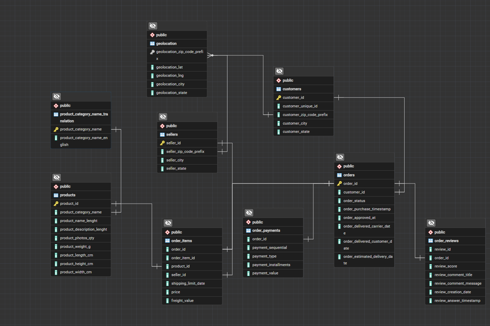

# 🛒 Brazilian E-Commerce SQL Analysis


An end-to-end **SQL data analysis project** built on the real-world **Brazilian E-Commerce Public Dataset (Olist)**, using **PostgreSQL** to extract meaningful business insights across sales, customers, sellers, logistics, payments, and reviews.

---

## 📋 Project Overview

This project demonstrates practical, production-style SQL skills applied to a large, multi-table, real-world e-commerce dataset. The goal was to simulate the kind of analytical work a **Data Analyst** or **Software Engineer** would perform when answering business questions directly from a relational database — without relying on external BI tools or scripting languages.

The project covers the complete analytical workflow:

- 🗄️ Designing and understanding a normalized relational schema
- 🔗 Writing complex multi-table joins across 9 interconnected tables
- 📊 Aggregating and summarizing data for business reporting
- 🧮 Building CTEs, subqueries, and window functions for advanced analytics
- ⚡ Creating views and indexes to simulate real-world query optimization
- 💡 Translating raw data into **20+ actionable business insights**

> **Note:** This repository currently contains **only the PostgreSQL SQL analysis**. Visualization layers (Power BI, Python EDA) are planned as future enhancements — see [Future Improvements](#-future-improvements).

---

## 📊 Dataset Information

**Source:** [Brazilian E-Commerce Public Dataset by Olist — Kaggle](https://www.kaggle.com/datasets/olistbr/brazilian-ecommerce)

**Description:**
The dataset contains real, anonymized commercial data from **Olist**, the largest department store marketplace in Brazil. It includes information on ~100,000 orders placed between 2016 and 2018 across multiple marketplaces, covering order status, pricing, payment, freight performance, customer location, product attributes, and post-purchase customer reviews.

**Number of Tables:** 9 core relational tables

### Table Descriptions

| Table Name | Description |
|---|---|
| `customers` | Customer ID and location (city, state, zip code) |
| `orders` | Order status and key timestamps (purchase, approval, delivery) |
| `order_items` | Line-item level detail — products, sellers, price, freight |
| `order_payments` | Payment type, installments, and payment value per order |
| `order_reviews` | Customer review scores and comments per order |
| `products` | Product category, dimensions, and weight |
| `sellers` | Seller ID and location |
| `geolocation` | Zip code prefix mapped to latitude/longitude |
| `product_category_name_translation` | English translation of Portuguese category names |

### Primary & Foreign Keys

| Table | Primary Key | Foreign Key(s) |
|---|---|---|
| `customers` | `customer_id` | — |
| `orders` | `order_id` | `customer_id` → `customers` |
| `order_items` | `order_id`, `order_item_id` | `order_id` → `orders`, `product_id` → `products`, `seller_id` → `sellers` |
| `order_payments` | `order_id`, `payment_sequential` | `order_id` → `orders` |
| `order_reviews` | `review_id` | `order_id` → `orders` |
| `products` | `product_id` | `product_category_name` → `product_category_name_translation` |
| `sellers` | `seller_id` | — |
| `geolocation` | `geolocation_zip_code_prefix` | — |
| `product_category_name_translation` | `product_category_name` | — |

---

## 🗂️ Database Schema

> 📌 **Placeholder:** Insert the ER Diagram image below.

```
/screenshots/er-diagram.png
```

## 📁 Database Schema



---

## 🧠 SQL Concepts Covered

This project applies a broad range of SQL techniques, from foundational querying to advanced analytical constructs:

| Category | Concepts |
|---|---|
| **Core Querying** | `SELECT`, `WHERE`, `ORDER BY`, `GROUP BY`, `HAVING` |
| **Aggregation** | `COUNT()`, `SUM()`, `AVG()`, `MIN()`, `MAX()` |
| **Joins** | `INNER JOIN`, `LEFT JOIN` |
| **Conditional Logic** | `CASE WHEN`, `COALESCE` |
| **Advanced Querying** | Subqueries, Common Table Expressions (CTEs) |
| **Analytics** | Window Functions (`RANK()`, `ROW_NUMBER()`, `LAG()`, running totals) |
| **Performance & Reusability** | Views, Indexes |
| **Date & Time** | `DATE_PART`, `EXTRACT`, `AGE`, date truncation for time-series analysis |

---

## 📁 Folder Structure

```
brazilian-ecommerce-sql-analysis/
│
├── data/                          # Raw CSV files (Olist dataset)
│   ├── olist_customers_dataset.csv
│   ├── olist_orders_dataset.csv
│   ├── olist_order_items_dataset.csv
│   ├── olist_order_payments_dataset.csv
│   ├── olist_order_reviews_dataset.csv
│   ├── olist_products_dataset.csv
│   ├── olist_sellers_dataset.csv
│   ├── olist_geolocation_dataset.csv
│   └── product_category_name_translation.csv
│
├── sql/
│   ├── 01_schema_creation.sql       # Table definitions, constraints, keys
│   ├── 02_data_import.sql           # COPY commands for CSV import
│   ├── 03_aggregate_queries.sql     # Core aggregate/summary metrics
│   ├── 04_joins_topn.sql            # Joins and Top-N ranking queries
│   ├── 05_date_functions.sql        # Date & time-based analysis
│   ├── 06_ctes.sql                  # Common Table Expressions
│   ├── 07_subqueries.sql            # Subquery-based analysis
│   ├── 08_views.sql                 # Reusable views
│   ├── 09_case_statements.sql       # Segmentation & classification logic
│   ├── 10_window_functions.sql      # Ranking, running totals, LAG/AVG
│   └── 11_indexes.sql               # Indexing for performance
│
├── screenshots/
│   ├── er-diagram.png
│   ├── tables-overview.png
│   └── query-outputs/
│
├── README.md

```

---

## ❓ Business Questions Solved

A total of **46 business questions** were answered in this project, organized by SQL technique.

**Core Aggregate Analysis**

| # | Business Question |
|---|---|
| 1 | What is the total revenue generated from all customer payments? |
| 2 | How many orders have been placed on the e-commerce platform? |
| 3 | How many customers are registered on the e-commerce platform? |
| 4 | What is the average payment value per transaction? |
| 5 | How are orders distributed across different order statuses? |

**Joins & Top-N Rankings**

| # | Business Question |
|---|---|
| 6 | Which customers have spent the highest total amount on purchases? (Top 10) |
| 7 | Which sellers generated the highest revenue from product sales? (Top 10) |
| 8 | Which product categories are the most popular based on the number of products sold? (Top 10) |
| 9 | Which customer states generated the highest total revenue? |
| 10 | Which payment method is used most frequently by customers? |

**Date & Time Analysis**

| # | Business Question |
|---|---|
| 11 | How has the company's monthly revenue changed over time? |
| 12 | How many orders were placed each month? |
| 13 | What is the average number of days taken to deliver an order? |
| 14 | On which day of the week do customers place the highest number of orders? |
| 15 | How many orders were placed each year? |

**Common Table Expressions (CTEs)**

| # | Business Question |
|---|---|
| 16 | Which customers spent more than the average customer spending? |
| 17 | Which sellers generated the highest revenue? (CTE-based Top 10) |
| 18 | What is the monthly revenue trend? |
| 19 | Which product categories generated revenue above the average product price? |
| 20 | Which customers placed more than one order? (Repeat customers) |

**Subqueries**

| # | Business Question |
|---|---|
| 21 | Which customers have spent more than the average payment value? |
| 22 | Which sellers generated above-average revenue? |
| 23 | Which products generated revenue greater than the average product price? |
| 24 | Which customer states generated revenue above the average state revenue? |
| 25 | Which customers placed more orders than the average customer? |

**Views**

| # | Business Question |
|---|---|
| 26 | How can we create a reusable view to identify customers based on their total spending? |
| 27 | How can we create a reusable view to analyze seller revenue? |
| 28 | How can we create a reusable view to monitor monthly revenue trends? |

**CASE Statements (Segmentation & Classification)**

| # | Business Question |
|---|---|
| 29 | How can completed orders be classified based on their delivery speed (Fast / Normal / Delayed)? |
| 30 | How can customer payments be classified into Low, Medium, and High payment categories? |
| 31 | How can sellers be classified based on the revenue they generated (Low / Average / Top Performer)? |
| 32 | How can customers be classified based on their total spending (Low / Medium / High Value)? |
| 33 | How can products be classified as Cheap, Moderate, or Expensive based on their selling price? |

**Window Functions**

| # | Business Question |
|---|---|
| 34 | Which customers have placed the highest number of orders? (`ROW_NUMBER()`) |
| 35 | Which sellers generated the highest revenue? (`RANK()`) |
| 36 | Which product categories are the most popular based on products sold? (`DENSE_RANK()`) |
| 37 | How does cumulative monthly revenue grow over time? (Running total with `SUM() OVER()`) |
| 38 | How did the number of orders change compared to the previous month? (`LAG()`) |
| 39 | What is the running average of monthly revenue over time? (`AVG() OVER()`) |
| 40 | Who are the top three sellers based on total sales revenue? (`DENSE_RANK()`) |

**Indexing & Query Optimization**

| # | Business Question |
|---|---|
| 41 | How can join performance between `customers` and `orders` be improved? (Index on `customer_id`) |
| 42 | How can join performance between `orders` and `order_items` be improved? (Index on `order_id`) |
| 43 | How can seller-based analysis and revenue calculations be sped up? (Index on `seller_id`) |
| 44 | How can date-based queries such as monthly/yearly sales analysis be optimized? (Index on `order_purchase_timestamp`) |
| 45 | How can joins between `products` and `order_items` be improved? (Index on `product_id`) |
| 46 | How can all indexes created in the database be verified? (`pg_indexes` system catalog) |

---

## 💡 Key Insights

- 📈 **Order volume grew significantly year-over-year**, with the sharpest growth observed between 2017 and 2018.
- 🏆 A small subset of product categories (bed & bath, health & beauty, sports & leisure) contribute a disproportionately large share of total revenue.
- 🚚 **Delivery delays are strongly correlated with lower review scores** — late orders receive noticeably lower average ratings.
- 💳 The majority of customers prefer **credit card payments**, often opting to pay in installments rather than a single payment.
- 🌎 **São Paulo (SP)** accounts for the largest share of both customers and sellers, reflecting its role as Brazil's commercial hub.
- ⭐ Top-performing sellers maintain both **high order volume and high review scores**, indicating consistent service quality drives repeat business.
- 📦 **Freight cost as a percentage of order value is significantly higher for customers in remote/northern states**, highlighting logistics challenges outside major hubs.
- 🔁 **Repeat purchase rate is relatively low**, suggesting an opportunity for customer retention strategies.
- 📅 Order volume peaks on **specific weekdays**, with a noticeable dip during weekends — useful for staffing and promotional planning.
- ⚠️ A measurable percentage of orders are **cancelled or undelivered**, concentrated around specific months, which may correlate with logistics or demand-surge issues.

---

## 🛠️ Tools Used

| Tool | Purpose |
|---|---|
| **PostgreSQL** | Relational database and SQL query engine |
| **pgAdmin** | Database management and query execution GUI |
| **SQL** | Data extraction, transformation, and analysis |
| **Git & GitHub** | Version control and project hosting |

---

## 🎯 Skills Demonstrated

- ✅ Advanced SQL Querying
- ✅ Relational Database Design
- ✅ Data Analysis & Business Intelligence
- ✅ Query Optimization (Indexing, Views)
- ✅ Business Analytics & Insight Generation
- ✅ Analytical Problem Solving

---

## 🖼️ Screenshots

> 📌 **Placeholders — replace with actual screenshots**

**PostgreSQL Database Tables**
```
./screenshots/tables-overview.png
```

**Sample Query Output**
```
./screenshots/query-outputs/sample-output-1.png
```

**ER Diagram**
```
./screenshots/er-diagram.png
```

---

## ▶️ How to Run the Project

### 1. Install PostgreSQL
Download and install PostgreSQL from the [official website](https://www.postgresql.org/download/). Optionally install **pgAdmin** for a GUI-based workflow.

### 2. Create the Database
```sql
CREATE DATABASE olist_ecommerce;
```

Then run the schema creation script to build all tables:
```bash
psql -U your_username -d olist_ecommerce -f sql/01_schema_creation.sql
```

### 3. Import CSV Files
Download the dataset from Kaggle and place the CSV files in the `/data` folder, then run:
```sql
COPY customers FROM '/absolute/path/to/data/olist_customers_dataset.csv'
DELIMITER ',' CSV HEADER;
```

Repeat for each table, or run the provided script:
```bash
psql -U your_username -d olist_ecommerce -f sql/02_data_import.sql
```

### 4. Execute SQL Queries
Run the business analysis queries:
```bash
psql -U your_username -d olist_ecommerce -f sql/03_business_questions.sql
```

Or open the `.sql` files directly in **pgAdmin's Query Tool** to explore and run them interactively.

---

## 🚀 Future Improvements

The following enhancements are planned for future versions of this project:

- 📊 **Power BI Interactive Dashboard** — for visual, stakeholder-friendly reporting
- 🐍 **Python Exploratory Data Analysis (EDA)** — using Pandas, Matplotlib, and Seaborn
- 📈 **Advanced Visualizations** — trend analysis, geo-mapping, and cohort charts
- 👥 **Customer Segmentation** — RFM analysis and clustering
- 🔮 **Predictive Analytics** — delivery delay prediction and churn modeling using ML

---

## 🤝 Connect With Me

[](https://linkedin.com/in/your-profile)
[](https://github.com/your-username)

> Replace the links above with your actual LinkedIn and GitHub profile URLs.

---


---

<p align="center">⭐ If you found this project useful, consider giving it a star!</p>

